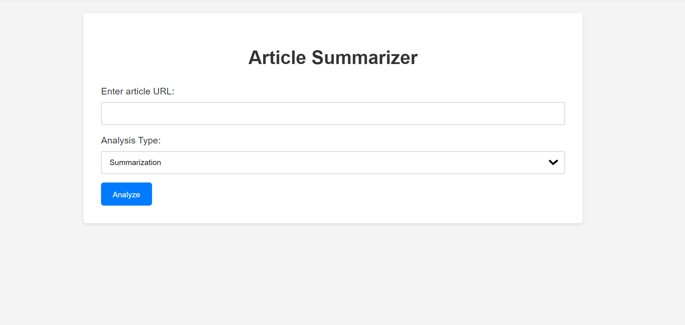
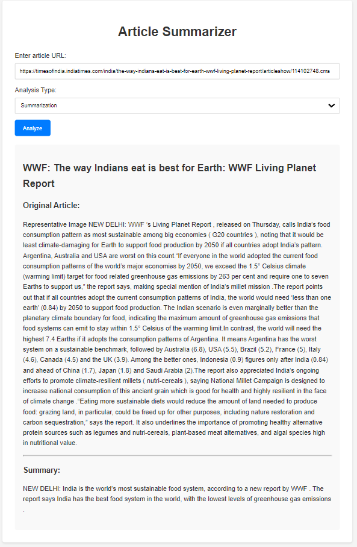

# Article Analyzer

This project provides a simple web application that analyzes news articles using Natural Language Processing (NLP) techniques. It offers three main functionalities:

* **Summarization:** Generates a concise summary of the article.
* **Named Entity Recognition (NER):** Identifies and extracts named entities (people, organizations, locations, etc.) from the article.
* **Sentiment Analysis:** Determines the overall sentiment (positive, negative, or neutral) of the article.

## Screenshots

Here are some screenshots of the application:

**Home Page:**



The home page presents a simple form where you can enter the URL of the article you want to analyze. You can then choose from three analysis options:

* Summarization
* Named Entity Recognition
* Sentiment Analysis

**Summarization Example:**



This screenshot shows an example of the summarization output. The original article and the generated summary are displayed.

**Other Screenshots:**

More screenshots showcasing the NER and sentiment analysis outputs can be found in the `screenshots` folder.

## How to Use

1. **Clone the repository:**

   ```bash
   
   git clone https://github.com/tarun-here/Article-Analyzer.git
   
2. **Install the required packages:**
   ```bash
   pip install -r requirements.txt
   
3. **Download the necessary models:**

   * **Summarization:**
      * Replace `"my_summarization_tokenizer"` and `"my_summarization_model"` in `app.py` with the paths to your summarization tokenizer and model.
      * If you don't have your own summarization model, you can use a pre-trained one from Hugging Face Hub. 
   * **NER:**
      * This project assumes you have a fine-tuned NER model saved in the `"our_ner_model"` directory.
      * If you want to use a different NER model, update the `ner_tokenizer` and `ner_model` lines in `app.py` accordingly.
   * **Sentiment:**
      * The code uses the `distilbert-base-uncased-finetuned-sst-2-english` model for sentiment analysis. You can change this to a different model if needed.
4. **Run the Flask app:**
   ```bash
   python app.py


## Using Your Own Models

* **Summarization and NER:** 
    * To use your own summarization or NER models, replace the placeholder model names (`"my_summarization_tokenizer"`, `"my_summarization_model"`, `"our_ner_model"`) in `app.py` with the paths to your saved models. 
    * Make sure the models are compatible with the Hugging Face Transformers library. 

* **Sentiment analysis:**
    * You can change the sentiment analysis model by modifying the `sentiment_model` line in `app.py`.
    * Choose a model from Hugging Face Hub that is suitable for sentiment analysis.

## Acknowledgments

* This project utilizes the Hugging Face Transformers library for NLP tasks.
* The NER model was fine-tuned on the CoNLL 2003 dataset, and Summarization was fine-tuned on CNN-Daily Mail available through the Hugging Face Datasets library.
* Thanks to Hugging Face for providing the tools and resources that made this project possible.
